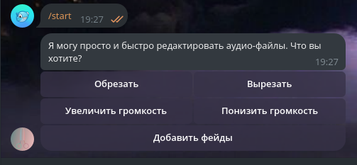
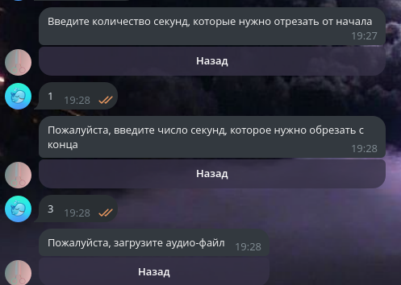
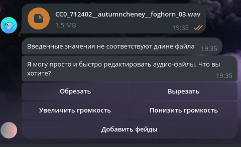

# Shibal

This repository contains the source files for a simple Telegram bot named **ShibalAudio** ([@shibal_wav_bot](https://t.me/shibal_wav_bot)), designed to edit audio files.
The primary goal of this project was not to create something highly practical, but rather to learn new skills and refresh existing ones within a short timeframe.
The current version of the bot was developed in just 4-5 days and should be considered a proof of concept rather than a fully functional tool.
As such, it is still in its early stages and may have limited functionality.

# Contents

The project is organized into four directories:

- **[shibal](https://github.com/doojonio/shibal/tree/main/shibal)**: Contains three services (an admin web server built with FastAPI, celery queue tasks, and a Telegram bot handler) unified under a single codebase.
- **[front_stats](https://github.com/doojonio/shibal/tree/main/front_stats)**: Includes the source code for the admin web server's frontend, developed using Angular 19.
- **[drive](https://github.com/doojonio/shibal/tree/main/drive)**: A lightweight microservice written in Rust, featuring two primary methods: 1) file upload and 2) file download.
- **[nginx](https://github.com/doojonio/shibal/tree/main/nginx)**: Contains configuration files for a local NGINX load balancer, which proxies requests to the API and frontend containers.

# Run

To run the project locally using Docker Compose, you only need a Telegram bot API token. Save the token in the `.env` file, following the format provided in `.env.sample`. Once the token is set, launch the project with the following command:

```bash
docker compose up
```

# Service Flow

The Telegram bot can be accessed in a Telegram chat by using the `/start` command:



Upon starting, the bot will prompt the user to select an action. Currently, there are five available commands:

1. **Обрезать (Trim)**
2. **Вырезать (Cut)**
3. **Увеличить громкость (Volume Up)**
4. **Уменьшить громкость (Volume Down)**
5. **Добавить фейды (Fade In/Fade Out)**

> **Note**: `volume up` and `volume down` commands are interchangable by using negative numbers, so actually there are 4 distinct commands.

After selecting a command, the bot will request additional information from the user and then prompt them to upload an audio file:



Once the user uploads an audio file as a document, the bot will perform the following steps:

1. Register the user in the database (if not already registered).
2. Upload the document to the Drive service.
3. Pass the user's ID and the uploaded document's ID to a Celery queue task.
4. Wait for a response from Celery.

If Celery encounters an exception, the bot will notify the user. If the issue is related to the user's input, the bot will provide specific feedback:



