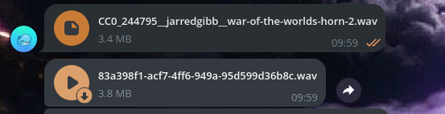
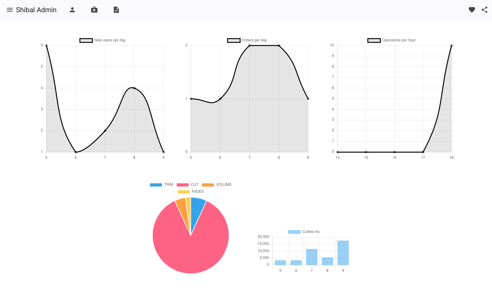
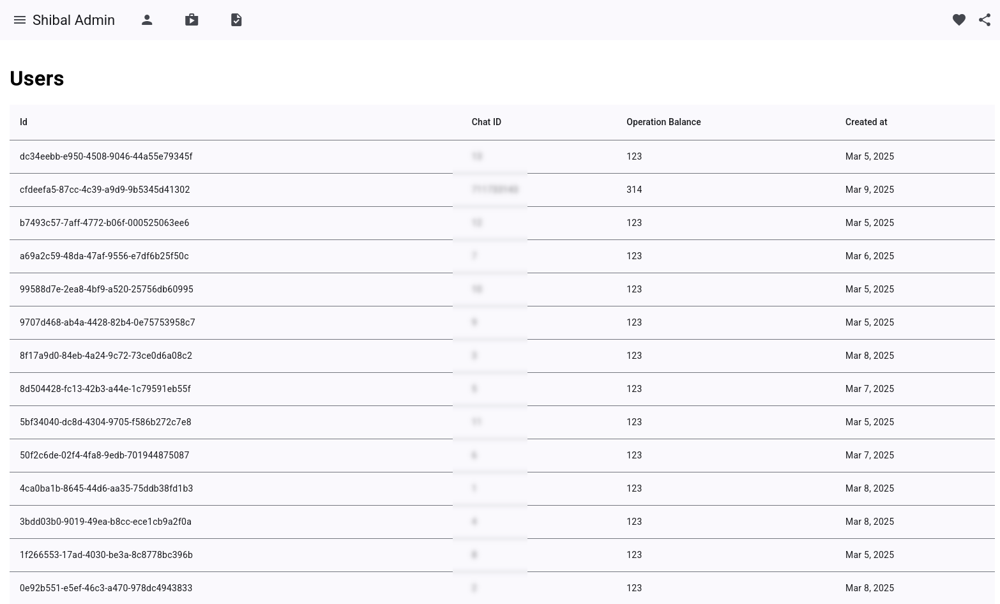

# Shibal

This repository contains the source files for a simple Telegram bot named **ShibalAudio** ([@shibal_wav_bot](https://t.me/shibal_wav_bot)), designed to edit audio files.
The primary goal of this project was not to create something highly practical, but rather to learn new skills and refresh existing ones within a short timeframe.
The current version of the bot was developed in just 4-5 days and should be considered a proof of concept rather than a fully functional tool.
As such, it is still in its early stages and may have limited functionality.

# Contents

The project is organized into four directories:

- **[shibal](https://github.com/doojonio/shibal/tree/main/shibal)**: Contains three services (an admin web server built with FastAPI, celery queue tasks, and a Telegram bot handler) unified under a single codebase.
- **[front_stats](https://github.com/doojonio/shibal/tree/main/front_stats)**: Includes the source code for the admin web server's frontend, developed using Angular 19.
- **[drive](https://github.com/doojonio/shibal/tree/main/drive)**: A lightweight microservice written in Rust, featuring two primary methods: 1) file upload and 2) file download.
- **[nginx](https://github.com/doojonio/shibal/tree/main/nginx)**: Contains configuration files for a local NGINX load balancer, which proxies requests to the API and frontend containers.

# Run

To run the project locally using Docker Compose, you only need a Telegram bot API token. Save the token in the `.env` file, following the format provided in `.env.sample`. Once the token is set, launch the project with the following command:

```bash
docker compose up
```

# Service Flow

The Telegram bot can be accessed in a Telegram chat by using the `/start` command:


Upon starting, the bot will prompt the user to select an action. Currently, there are five available commands:

1. **Обрезать (Trim)**
2. **Вырезать (Cut)**
3. **Увеличить громкость (Volume Up)**
4. **Уменьшить громкость (Volume Down)**
5. **Добавить фейды (Fade In/Fade Out)**

> **Note**: `volume up` and `volume down` commands are interchangable by using negative numbers, so actually there are 4 distinct commands.

After selecting a command, the bot will request additional information from the user and then prompt them to upload an audio file:


Once the user uploads an audio file as a document, the bot will perform the following steps:

1. Register the user in the database (if not already registered).
2. Download the file from Telegram and upload it to the Drive service.
3. Pass the user's ID and the uploaded document's ID to a Celery queue task.
4. Wait for a response from Celery.

If Celery encounters an exception, the bot will notify the user. If the issue is related to the user's input, the bot will provide specific feedback:


## Celery Task Processing

Once a task is received, the Celery worker will execute the following steps:

1. Create a new operation record in the database with the specified task type.
2. Download the audio file from the Drive service using the `file_id` provided by the Telegram bot.
3. Validate the audio file's format and length. If they do not meet the requirements or the user's input is invalid, the task will raise an exception and notify the bot.
4. If the file is valid, the worker will perform the requested operation (e.g., trim, cut, adjust volume, etc.).
5. Upload the processed file back to the Drive service.
6. Return the `file_id` of the processed file to the Telegram bot.

## Telegram Bot Receives the Result

Once the Celery worker completes the task, the Telegram bot will receive the `file_id` of the processed file. The bot will then download the file from the Drive service and send the processed result back to the user as a reply.



# Shibal Admin

The project includes an additional component called **Shibal Admin**. As mentioned earlier, the `shibal` directory contains not only the Telegram bot and Celery queue but also a web server that handles specific requests. This API provides access to various statistics and information, such as:

- User records
- Operation logs
- Order history
- Count of new users over the last N days
- Number of operations performed per hour
- Distribution of operations by type
- Count of new orders over the last N days

To present this data in a visually appealing and user-friendly format, the `front_stats` Angular 19 project is used.

Currently, the system does not support admin authentication or authorization. Therefore, it is recommended to secure the web server by isolating it from external access (e.g., via network restrictions).

## Home Page

When an admin accesses the web interface, they are greeted with the **Home Page**, which displays several charts summarizing the latest data:

1. **New Users Count**: Number of new users over the last 5 days.
2. **Orders Count**: Number of orders placed over the last 5 days.
3. **Operations Count**: Number of operations performed over the last 5 hours.
4. **Operations Distribution**: A pie chart showing the distribution of operation types (e.g., trim, cut, volume adjustments, etc.).
5. **Cut Milliseconds**: Total milliseconds trimmed or cut over the last 5 days.



## Users Page

By clicking the **Users** icon in the toolbar, the admin can navigate to the **Users Page**. This page displays a table with the following columns:

1. **Id**: The user's unique ID in the database. Clicking this field redirects the admin to the user's detailed page.
2. **Chat ID**: The user's Telegram chat ID.
3. **Operation Balance**: The remaining number of operations the user can perform.
4. **Created At**: The date the user was registered.


